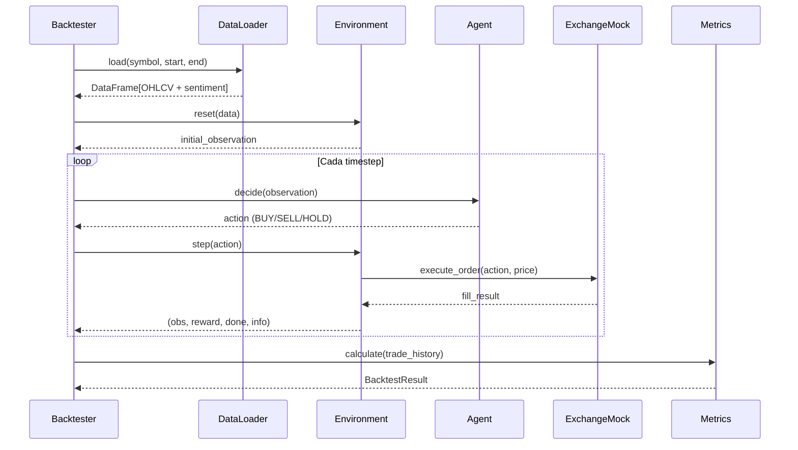

# 🏋️ SENTINEL Gym — Arquitectura del Motor de Simulación

## Visión General

El **SENTINEL Gym** (nombre interno: **Cortex**) es el motor de backtesting y simulación del sistema de trading. Permite ejecutar estrategias contra datos históricos antes de arriesgar capital real.

```
┌─────────────────────────────────────────────────────────────────┐
│                        SENTINEL CORTEX                          │
│                                                                  │
│  ┌──────────┐    ┌─────────────┐    ┌──────────────────────┐   │
│  │DataLoader│───▶│ Environment │◀──▶│      Agent           │   │
│  │(Parquet) │    │  (Gym API)  │    │ (Statistical / LLM)  │   │
│  └──────────┘    └──────┬──────┘    └──────────────────────┘   │
│                         │                                        │
│              ┌──────────┴──────────┐                            │
│              │                     │                            │
│         ┌────▼─────┐        ┌─────▼────┐                       │
│         │ Exchange │        │ Metrics  │                       │
│         │  Mock    │        │ Engine   │                       │
│         │(Binance) │        │(Sharpe,  │                       │
│         └──────────┘        │ PnL...) │                       │
│                             └──────────┘                       │
│                                  │                              │
│                          ┌───────▼───────┐                     │
│                          │  Backtester   │                     │
│                          │  (Runner)     │                     │
│                          └───────────────┘                     │
└─────────────────────────────────────────────────────────────────┘
```

---

## Estructura de Archivos

```
cortex/
├── __init__.py
├── gym/
│   ├── __init__.py
│   ├── config.yaml          # Configuración de simulación
│   ├── environment.py        # Entorno Gymnasium (step/reset/render)
│   ├── data_loader.py        # Carga Parquet + Sentimiento
│   └── exchange_mock.py      # Simula Binance con fees y slippage
├── agents/
│   ├── __init__.py
│   ├── base_agent.py         # Interfaz abstracta
│   ├── buy_hold_agent.py     # Baseline: compra y mantiene
│   ├── statistical_agent.py  # Señales por indicadores técnicos
│   └── llm_agent.py          # Análisis via LLM (Bedrock)
├── strategies/
│   ├── __init__.py
│   ├── swing.py              # Swing trading (horas/días)
│   └── contrarian.py         # Detección de manipulación
├── metrics.py                # Sharpe, MaxDD, PnL, Win Rate
└── backtester.py             # Orquestador de backtests
```

---

## Componentes

### 1. DataLoader (`data_loader.py`)

Carga y fusiona datos de precios (Parquet) con datos de sentimiento (CSV).

**Input:**
- `data/market/raw/BTC-USD_1d.parquet` — OHLCV diario
- `data/sentimental/raw/merged/merged_daily.csv` — sentimiento por modelo

**Output:** DataFrame unificado:

| Columna | Tipo | Fuente |
|---|---|---|
| `timestamp` | datetime | Precios |
| `open`, `high`, `low`, `close` | float | Precios |
| `volume` | float | Precios |
| `sentiment_score` | float [-1, 1] | Sentimiento |
| `sentiment_model` | str | Sentimiento |

**Modos:**
- `local` — Lee de disco (`data/`)
- `s3` — Lee de S3 (`s3://bucket/raw/`)

---

### 2. Environment (`environment.py`)

Entorno compatible con la API de [Gymnasium](https://gymnasium.farama.org/).

**Action Space:** `Discrete(3)`
| Acción | Valor | Significado |
|---|---|---|
| HOLD | 0 | No hacer nada |
| BUY | 1 | Comprar con % del capital |
| SELL | 2 | Vender toda la posición |

**Observation Space:** `Dict`
```python
{
    "prices": Box(shape=(window_size, 5)),  # OHLCV últimas N velas
    "position": Box(shape=(1,)),             # Posición actual (0 o cantidad)
    "portfolio_value": Box(shape=(1,)),      # Valor total en USD
    "sentiment": Box(shape=(1,)),            # Score de sentimiento [-1, 1]
}
```

**Reward:** Cambio porcentual del portfolio value respecto al paso anterior.

**Hold Penalty (Penalización por inactividad):**

Por cada step donde el agente elige HOLD, se le **descuenta el 5% de su cash disponible**. Esto fuerza a los agentes a tomar decisiones activas en lugar de quedarse pasivos.

```
Penalty = cash × 0.05 (por cada HOLD)

Ejemplo con $100 cash:
  Step 1: HOLD → -$5.00  → Cash = $95.00
  Step 2: HOLD → -$4.75  → Cash = $90.25
  Step 3: BUY  → $0.00   → Sin penalización
  Step 4: HOLD → -$0.10  → (solo cash restante, no posiciones)
```

> ⚠️ **Nota**: La penalización solo afecta el cash disponible, no las posiciones abiertas. Un agente que compra temprano y mantiene su posición no pierde cash extra (porque su cash ya está invertido).

---

### Score System (Sistema de Puntuación)

El Gym mantiene un **score dinámico de 0 a 1000** que refleja el rendimiento acumulado del agente:

| Evento | Efecto en Score | Multiplicador |
|---|---|---|
| Ganancia (reward > 0) | ↑ Sube | `+reward × 100` |
| Pérdida (reward < 0) | ↓ Baja | `+reward × 150` (1.5x más severo) |
| Hold Penalty aplicada | ↓ Baja | `-(penalty/capital) × 50` |

```python
# Score empieza en 1000
if reward > 0:
    score += reward * 100     # Ganancias suben el score
elif reward < 0:
    score += reward * 150     # Pérdidas bajan 1.5x más
if hold_penalty > 0:
    score -= (penalty / initial_capital) * 50

score = clamp(score, 0, 1000)
```

> Un score de **1000** = rendimiento perfecto. Un score de **0** = el agente ha colapsado.

**Ciclo:**
```
reset() → observation (score=1000)
  └─ step(action) → (observation, reward, terminated, truncated, info)
       └─ step(action) → ...
            └─ (terminated=True cuando se acaban los datos)
```

---

### 3. Exchange Mock (`exchange_mock.py`)

Simula un exchange con costos realistas.

| Parámetro | Default | Descripción |
|---|---|---|
| `fee_rate` | 0.001 (0.1%) | Comisión por operación (Binance standard) |
| `slippage` | 0.0005 (0.05%) | Deslizamiento simulado de precio |
| `initial_capital` | $100 | Capital inicial en USDT |

**Operaciones:**
- `buy(symbol, usd_amount, price)` → Ejecuta compra con fees
- `sell(symbol, quantity, price)` → Ejecuta venta con fees
- `get_portfolio_value(prices)` → Valor total (cash + posiciones)

**Ejemplo:**
```python
exchange = ExchangeMock(initial_capital=100.0, fee_rate=0.001)
exchange.buy("BTCUSDT", usd_amount=50.0, price=42000.0)
# → Compra 0.001189 BTC (después de 0.1% fee)
# → Cash restante: $50.00
```

---

### 4. Agents (`agents/`)

Todos los agentes implementan la interfaz base:

```python
class BaseAgent(ABC):
    @abstractmethod
    def decide(self, observation: dict) -> int:
        """Retorna acción: 0=HOLD, 1=BUY, 2=SELL"""
        pass

    @abstractmethod
    def reset(self):
        """Reiniciar estado interno"""
        pass
```

| Agente | Latencia | Descripción |
|---|---|---|
| `BuyHoldAgent` | 0ms | Baseline. Compra el primer día y mantiene |
| `StatisticalAgent` | <1ms | Indicadores técnicos (SMA crossover, RSI) |
| `LLMAgent` | 200-2000ms | Análisis vía Claude/Bedrock + sentimiento |

---

### 5. Metrics (`metrics.py`)

Métricas calculadas al final de cada backtest:

| Métrica | Fórmula | Meta |
|---|---|---|
| **Sharpe Ratio** | `(mean_return - rf) / std_return × √252` | > 2.0 |
| **Max Drawdown** | `max(peak - trough) / peak` | < -20% |
| **Total PnL** | `final_value - initial_capital` | > 0 |
| **Win Rate** | `winning_trades / total_trades` | > 55% |
| **Profit Factor** | `gross_profit / gross_loss` | > 1.5 |
| **Total Trades** | Número de operaciones ejecutadas | — |

---

### 6. Backtester (`backtester.py`)

Orquestador que conecta todo:

```python
result = Backtester.run(
    config="cortex/gym/config.yaml",
    agent=StatisticalAgent(),
    start_date="2023-01-01",
    end_date="2024-12-31",
)
# → BacktestResult(sharpe=1.8, max_dd=-0.08, pnl=43.20, ...)
```

**Salida:** CSV con cada paso:
```
timestamp, action, price, portfolio_value, position, reward, reasoning
2023-01-01, BUY, 16500.00, 100.00, 0.006, 0.0, "SMA crossover bullish"
2023-01-02, HOLD, 16800.00, 101.82, 0.006, 0.018, ""
...
```

---

## Configuración (`config.yaml`)

```yaml
simulation:
  initial_capital_usd: 100.0     # Capital inicial
  base_currency: "USDT"
  fee_rate: 0.001                 # 0.1% (Binance)
  slippage: 0.0005                # 0.05%

assets:
  - symbol: "BTCUSDT"
    weight: 0.5
  - symbol: "ETHUSDT"
    weight: 0.3
  - symbol: "SOLUSDT"
    weight: 0.2

logic:
  mode: "swing"                    # "swing" o "hft"
  update_interval_minutes: 60
  risk_per_trade_pct: 0.1         # 10% del capital por trade
  hold_penalty_rate: 0.05         # 5% cash perdido por cada HOLD

scoring:
  initial_score: 1000
  gain_multiplier: 100             # score += reward × 100
  loss_multiplier: 150             # score += reward × 150 (más severo)
  penalty_multiplier: 50           # score -= (penalty/capital) × 50

models:
  primary: "claude-3-5-sonnet"
  fast_path: "claude-3-haiku"
  sentiment: "gemini-1.5-flash"
```

---

## Flujo de un Backtest



---

## Ejemplo de Uso

```bash
# Backtest con agente baseline (Buy & Hold)
python3 -m cortex.backtester \
    --config cortex/gym/config.yaml \
    --agent buy_hold \
    --start 2023-01-01 \
    --end 2024-12-31 \
    --output results/baseline.csv

# Backtest con agente estadístico
python3 -m cortex.backtester \
    --config cortex/gym/config.yaml \
    --agent statistical \
    --start 2023-01-01 \
    --end 2024-12-31 \
    --output results/statistical.csv

# Backtest con LLM (requiere Bedrock configurado)
python3 -m cortex.backtester \
    --config cortex/gym/config.yaml \
    --agent llm \
    --start 2023-01-01 \
    --end 2024-12-31 \
    --output results/llm.csv
```
